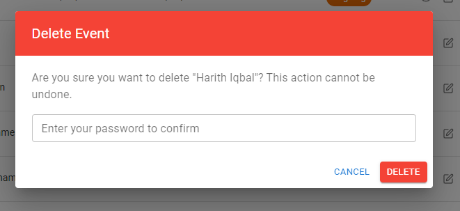

## To run application:

1. open `.env` file on backend folder and set your db port and name
2. `pnpm install` at root level and `pnpm dev` to concurrently run frontend and backend (monorepo)

screnshots:

